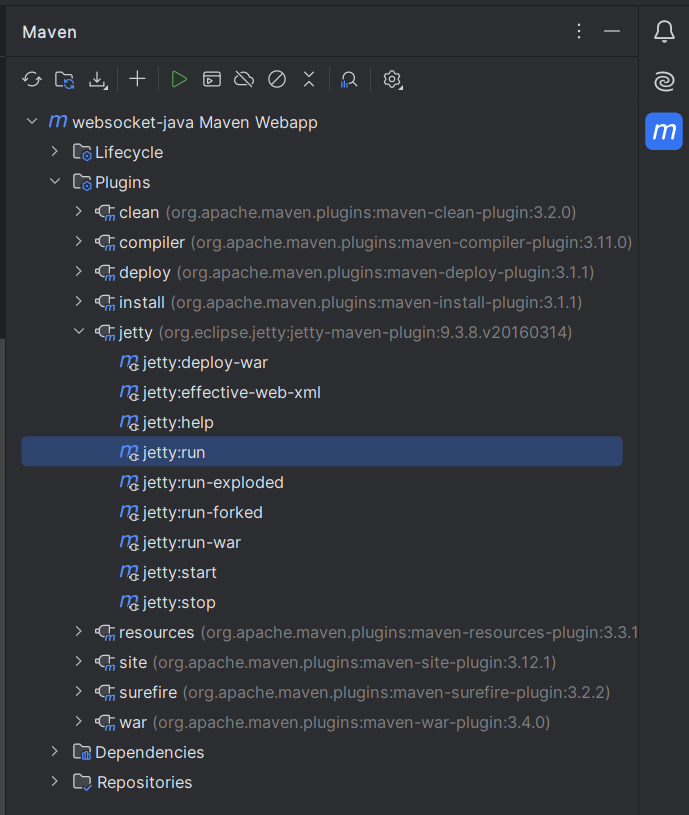
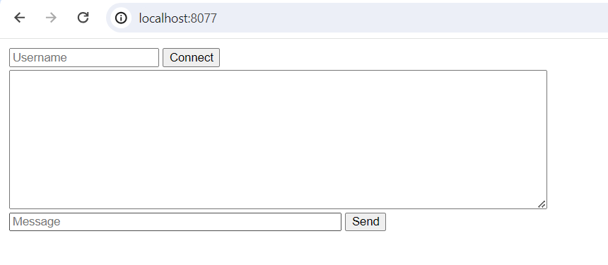
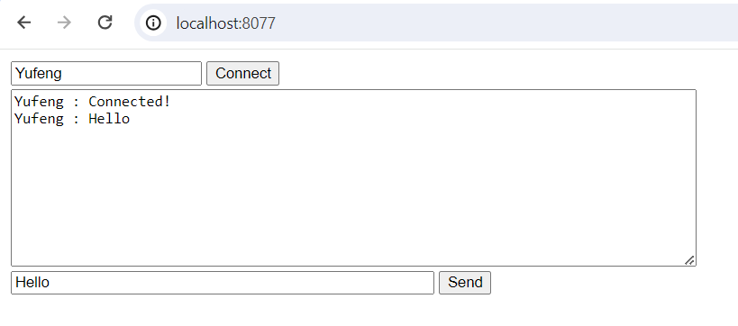

# Websocket java
A demo project show how to use Websocket in java, also contains a html client demonstrate how to consume the websocket. 

## Requirements
- Java 1.8+
- Maven 3.0+

## Maven artifacts
```
<dependency>
   <groupId>javax.websocket</groupId>
   <artifactId>javax.websocket-api</artifactId>
   <version>1.1</version>
   <scope>provided</scope>
</dependency>

<dependency>
   <groupId>com.google.code.gson</groupId>
   <artifactId>gson</artifactId>
   <version>2.8.0</version>
</dependency>
```
## Plugins
use jetty as web server
```
<plugin>
    <groupId>org.eclipse.jetty</groupId>
    <artifactId>jetty-maven-plugin</artifactId>
    <version>9.3.8.v20160314</version>
    <configuration>
        <!--<jettyXml>jetty-http.xml</jettyXml>-->
        <httpConnector>
            <port>8077</port>
        </httpConnector>
    </configuration>
</plugin>
```

## Usage
open the project in Intellij Idea, then use Maven tool to run the plugin.



after the server is started, use the browser to open index.html



input the Username, click the Connect button, then input the Message and click the Send button.

